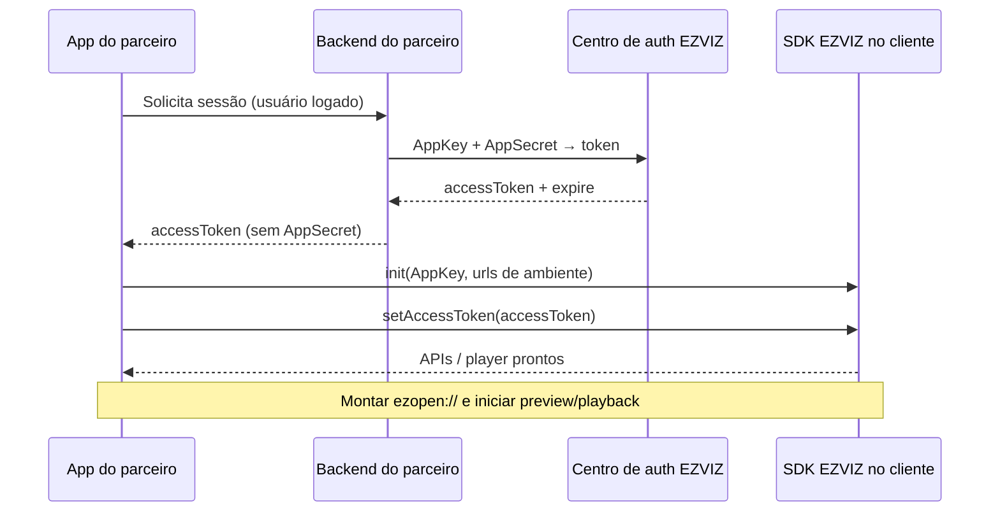

# Autenticação (conceitos compartilhados)

<!-- source: packages/crawler/docs/sdk/轻应用EZUIKit Web SDK/EZUIKit SDK概述.md -->
<!-- source: packages/crawler/docs/sdk/iOS SDK/iOS 预览/取流方式.md -->
<!-- source: packages/crawler/docs/sdk/Android SDK/Android 集成/Gradle安装.md -->

Ao concluir este capítulo, você será capaz de:

- Descrever o ciclo de vida das credenciais da EZVIZ Open Platform do ponto de vista do integrador.
- Diferenciar AppKey, AppSecret, accessToken, URL de autenticação e URL de domínio.
- Configurar backends de parceiro sem expor segredos no app cliente.
- Reagir a token expirado ou inválido antes de montar URIs [EZOpen](00-ezopen-protocol.md).

## Visão geral

A integração EZOpen pressupõe uma **aplicação registrada** na [EZVIZ Open Platform](https://open.ezviz.com). O parceiro obtém credenciais, troca segredos **somente no servidor** por tokens de acesso de curta duração e inicializa cada SDK (Android, iOS ou Web) com o contexto de ambiente correto. Sem autenticação válida, chamadas de API e endereços `ezopen://` falham — mesmo com serial e canal corretos.

Este capítulo é **genérico** (válido para todas as plataformas). Procedimentos específicos de SDK ficam nas Partes II–IV.

## Credenciais e papéis

| Credencial / URL | Onde vive | Para que serve |
|------------------|-----------|----------------|
| **AppKey** | App registrado na Open Platform | Identifica o produto do parceiro nas APIs |
| **AppSecret** | **Apenas servidor** do parceiro | Prova de identidade para **emitir** accessToken; nunca no app mobile/Web público |
| **accessToken** | Servidor → repassado ao SDK no cliente | Autoriza APIs e fluxos de vídeo na sessão atual |
| **URL de autenticação (auth)** | Configuração do SDK / backend | Endpoint do centro de autenticação (`openauth.ys7.com` ou equivalente regional/híbrido) |
| **URL de domínio (domain / open)** | Configuração do SDK / backend | API e contexto de negócio/streaming; **não** substitui o host `open.ezviz.com` nas URIs `ezopen://` |
| **Serial do dispositivo + canal** | Conta EZVIZ do usuário final | Identificam o fluxo dentro da URI EZOpen |

### AppKey e AppSecret

1. Crie um aplicativo no console EZVIZ e anote **AppKey** e **AppSecret**.
2. No **seu backend**, implemente a troca segura (fluxo oficial da Open Platform) que devolve `accessToken` e tempo de expiração ao app.
3. No cliente, use apenas `YOUR_APP_KEY` em exemplos de código público; em produção, injete a AppKey real via configuração segura, nunca o AppSecret.

### accessToken

- Representa a sessão autorizada para APIs e players.
- Deve ser obtido e renovado pelo **servidor do parceiro**; o app chama seu backend, não expõe AppSecret.
- Ao inicializar o SDK nativo, use o modo **AccessToken** salvo que o corpus oficial descreve como padrão para a maioria dos integradores (modo de token restrito / TKToken é opcional e exige backend adicional — fora do happy path v1).

Validação comportamental recomendada após `setAccessToken`: solicitar lista de dispositivos (ou endpoint leve equivalente). Se a API responder com sucesso, o token é aceito; se retornar erro de autorização, trate como token inválido ou expirado antes de qualquer `ezopen://`.

## Ciclo de vida (genérico)

Etapas:

1. **Registro** — aplicativo na Open Platform.
2. **Emissão** — backend troca AppSecret por `accessToken`.
3. **Inicialização** — SDK com AppKey e URLs de ambiente (padrão ou híbridas).
4. **Autorização** — `accessToken` aplicado ao SDK.
5. **Uso** — dispositivos, preview, playback; URIs EZOpen conforme [Part I § EZOpen](00-ezopen-protocol.md).
6. **Renovação** — ao detectar falha de auth, repetir passo 2; não reutilizar token expirado.

## URLs de ambiente

### Plataforma aberta pública

Valores padrão usados na documentação oficial (China):

| Função | URL padrão (China) |
|--------|---------------------|
| Domínio / API | `https://open.ezviz.com` |
| Autenticação | `https://openauth.ys7.com` |

Outras regiões usam hosts `open.ezvizlife.com`, `openauth.ezvizlife.com`, etc. Consulte a tabela regional no corpus Android/iOS antes de publicar o app internacional.

### Nuvem privada / híbrida

Quando o contrato exige infraestrutura dedicada, o parceiro recebe **URL de autenticação** e **URL de domínio** próprias. O SDK deve ser inicializado com esses endpoints (equivalente a informar `apiUrl` / `authUrl` nos SDKs nativos). As URIs `ezopen://` continuam com host **`open.ezviz.com`** — o domínio customizado fica na configuração do SDK, não no esquema EZOpen.

> **Exemplo (não obrigatório):** URL de autenticação `https://authhybridcloud.emivecloud.com` e URL de domínio `https://hybridcloud.emivecloud.com` — ilustram um par auth/domínio de parceiro; **não** são obrigatórias para todos os integradores. Substitua pelos endpoints do **seu** contrato EZVIZ.

## O que fazer quando a autenticação falha

Comportamento esperado do app (todas as plataformas):

1. **Detectar** — erro em login de token, lista de dispositivos vazia com erro, ou código de auth no player.
2. **Não** reutilizar o mesmo `accessToken` em loop infinito.
3. **Solicitar** novo token ao backend do parceiro (fluxo de refresh/login).
4. **Reaplicar** `setAccessToken` / parâmetro `accessToken` do EZUIKit.
5. **Só então** retentar `ezopen://` — URIs corretas com token inválido continuam falhando.

Expiração: o campo `expire` (ou equivalente na resposta do seu backend) deve orientar renovação **proativa** antes do vencimento em sessões longas (mosaico, playback prolongado).

## Relação com EZOpen

| Etapa de auth | Impacto no stream |
|---------------|-------------------|
| Token válido + domínio/auth corretos no SDK | Stream pode iniciar com URI `ezopen://open.ezviz.com/...` |
| Token expirado | Player falha independentemente da URI bem formada |
| Domínio ou auth do SDK desalinhados ao token | Falha típica “sem vídeo” — ver [checklist EZOpen](00-ezopen-protocol.md#checklist-de-validação-de-uri) |

Ordem recomendada: **auth pronta → (Web) container no DOM → URI EZOpen → player → play**.

## Segurança (resumo)

- AppSecret e tokens de usuário **nunca** em repositório Git, logs públicos ou screenshots de suporte.
- Use placeholders em documentação e exemplos: `YOUR_APP_KEY`, `YOUR_ACCESS_TOKEN`.
- HTTPS obrigatório para todas as chamadas ao backend do parceiro e à Open Platform.
- Detalhes adicionais: Parte V (`part-05-best-practices/03-security.md`).

## Referências cruzadas

- Formato `ezopen://`: [Referência do protocolo EZOpen](00-ezopen-protocol.md)
- Suporte por plataforma: [Glossário e matriz de capacidades](02-glossary-capability-matrix.md)

## Checklist de verificação (fechamento)

- [ ] AppKey no cliente; AppSecret apenas no servidor.
- [ ] Sei qual par auth/domínio usar (público vs híbrido) no meu contrato.
- [ ] Tenho fluxo de renovação quando o accessToken expira ou é rejeitado.
- [ ] Valido o token (ex.: lista de dispositivos) antes de abrir streams EZOpen.
- [ ] Exemplos Emive/híbridos nos blocos de citação foram tratados como ilustração, não como configuração obrigatória.
