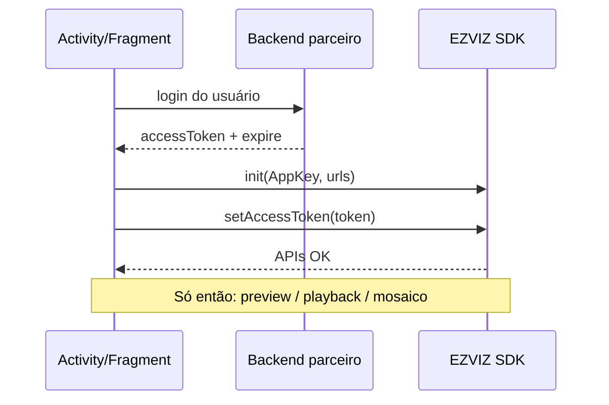

# Autenticação (Android)

<!-- source: packages/crawler/docs/sdk/Android SDK/Android 集成/Gradle安装.md -->
<!-- source: packages/crawler/docs/sdk/Android SDK/Android 集成/初始化SDK.md -->

Ao concluir este capítulo, você será capaz de:

- Integrar o SDK Android EZVIZ no app do parceiro (Gradle, permissões mínimas).
- Inicializar o SDK com AppKey e URLs de ambiente (pública ou híbrida).
- Aplicar `accessToken` obtido do backend do parceiro e validar a sessão antes de vídeo.
- Renovar token e recuperar de falhas de auth sem loops infinitos.

> Conceitos compartilhados (AppKey, AppSecret, ciclo de vida): [Autenticação (conceitos compartilhados)](../part-01-shared-concepts/01-auth.md).

## Pré-requisitos

- Conta de desenvolvedor na [EZVIZ Open Platform](https://open.ezviz.com) com **AppKey** registrada.
- **Backend do parceiro** capaz de trocar AppSecret por `accessToken` (AppSecret **nunca** no APK).
- Android **minSdk** conforme a versão do AAR oficial que você integrou (consulte a nota de release do pacote no portal EZVIZ).

## Integração Gradle

1. Adicione o repositório Maven indicado na documentação oficial do SDK Android (portal EZVIZ / artefato `com.ezviz.sdk` ou equivalente da sua versão).
2. Declare a dependência do **player + APIs** na variante de release do app.
3. Sincronize o projeto e confirme que não há conflito de versão com outros SDKs de mídia (ExoPlayer, etc.) — siga a matriz de dependências do release notes.

Permissões típicas (ajuste ao escopo do produto):

| Permissão | Quando |
|-----------|--------|
| `INTERNET` | APIs, streaming, provisioning |
| `ACCESS_NETWORK_STATE` | Detectar offline antes de preview |
| `RECORD_AUDIO` | Somente se usar intercom / talk |
| `CAMERA` | Somente se o fluxo de provisioning exigir QR |

## Inicialização do SDK

Ordem recomendada na `Application` ou na primeira Activity que usa EZVIZ:

1. **`initLibWithAppKey`** (ou API equivalente da sua versão) com a AppKey do parceiro.
2. **URLs de ambiente** — para Open Platform pública, o SDK pode usar padrões internos (China: `open.ezviz.com` / `openauth.ys7.com`). Para **nuvem híbrida**, informe explicitamente a URL de domínio (`apiUrl` / open) e a URL de autenticação conforme o contrato EZVIZ.
3. **`setAccessToken`** com o token retornado pelo backend do parceiro **depois** que o usuário estiver autenticado no seu app.

> **Exemplo (não obrigatório):** domínio `https://hybridcloud.emivecloud.com` e auth `https://authhybridcloud.emivecloud.com` — substitua pelos endpoints do **seu** ambiente.

### Modo AccessToken (v1)

O corpus oficial descreve o modo **AccessToken** como caminho padrão para integradores parceiros: o app recebe `accessToken` + tempo de expiração do seu servidor e repassa ao SDK. Modos de token restrito (TKToken / streamToken) exigem backend adicional — fora do happy path deste guia.

## Validação da sessão

Antes de abrir preview ou playback:

1. Chame um endpoint leve do SDK ou API de dispositivos (ex.: lista de câmeras da conta).
2. Se retornar sucesso, prossiga para montar URIs [EZOpen](../part-01-shared-concepts/00-ezopen-protocol.md).
3. Se retornar erro de autorização, **não** monte `ezopen://` — solicite novo token ao backend.

As URIs `ezopen://` usam host fixo **`open.ezviz.com`**; a URL de domínio (`apiUrl` / open) configura o SDK separadamente (ver [Referência EZOpen](../part-01-shared-concepts/00-ezopen-protocol.md)).

## Ciclo de vida no app Android

| Evento Android | Ação |
|----------------|------|
| `onCreate` da tela de vídeo | Garantir token válido; se ausente, redirecionar para login |
| Token próximo do `expire` | Renovar via backend **antes** de sessão longa (mosaico) |
| `onDestroy` | Não confundir com teardown do player — players têm capítulo próprio |
| Logout do usuário | Limpar token em memória; chamar APIs de logout do SDK se documentadas |

## Falhas comuns

| Sintoma | Causa provável | Correção |
|---------|----------------|----------|
| Lista de dispositivos vazia com erro | Token inválido ou expirado | Renovar `accessToken` |
| Preview sem imagem, APIs OK | `apiUrl`/auth desalinhados ao token | Conferir par domínio/auth do contrato; URI EZOpen com `open.ezviz.com` |
| `401` / código de auth no SDK | AppKey errada ou ambiente misturado | Conferir região (China vs internacional) |
| Crash na init | Versão de SDK vs minSdk | Atualizar AAR ou elevar minSdk |

## Segurança

- Não armazene AppSecret no app; use ProGuard/R8 mas **não** trate ofuscação como substituto de arquitetura segura.
- Em logs de debug, mascare `accessToken` (ex.: últimos 4 caracteres).
- Detalhes: [Segurança](../part-05-best-practices/03-security.md).

## Referências cruzadas

- [EZOpen](../part-01-shared-concepts/00-ezopen-protocol.md) — após auth válida
- [Visualização ao vivo](02-live-preview.md) — próximo passo típico
- [Matriz de capacidades](../part-01-shared-concepts/02-glossary-capability-matrix.md)

## Checklist de verificação (fechamento)

- [ ] AppKey no cliente; AppSecret apenas no servidor.
- [ ] `initLibWithAppKey` + URLs corretas para o ambiente (público ou híbrido).
- [ ] `setAccessToken` testado com chamada de API/dispositivos antes de vídeo.
- [ ] Fluxo de renovação de token implementado (sem retry infinito do mesmo token).
- [ ] URIs EZOpen documentadas para QA com host `open.ezviz.com`; domínio híbrido só no init do SDK.
