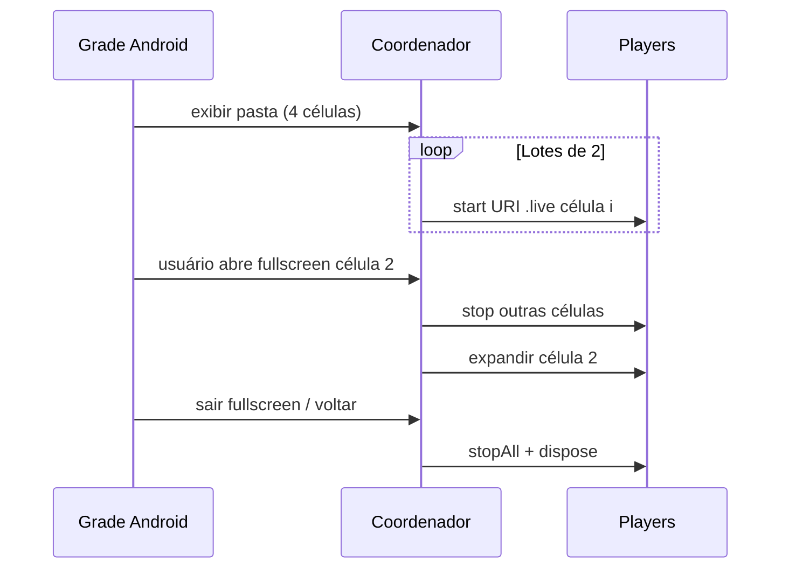

# Mosaico / multi-preview (Android)

<!-- source: packages/crawler/docs/sdk/Android SDK/Android 预览/多路预览.md -->
<!-- source: ADR-006 — padrões internos ezviz_flutter_package (prosa apenas) -->

Ao concluir este capítulo, você será capaz de:

- Montar uma grade com vários previews `.live` simultâneos.
- Gerenciar pasta/agrupamento, colunas de layout, iniciar/parar todos e tela cheia.
- Aplicar teardown completo ao sair da tela.
- Seguir regras de memória e thread documentadas em [Desempenho e mosaico](../part-05-best-practices/01-mosaic-performance.md).

> **Obrigatório:** leia [Desempenho e mosaico](../part-05-best-practices/01-mosaic-performance.md) antes de produção — teto de decoders, thread principal e dispose na navegação.

## Modelo conceitual

| Conceito | Android |
|----------|---------|
| **Pasta / grupo** | Lista lógica de câmeras (favoritos, andar, planta) |
| **Célula** | Um slot na grade com **uma** view de player |
| **URI por célula** | `ezopen://open.ezviz.com/{serial}/{channel}.live` distinta por câmera |
| **Sessão de mosaico** | Do `onAppear` da grade até `stopAll` + `dispose` no `onDisappear` |

Regra: **N células visíveis ⇒ até N streams ativos.** Célula oculta em lista rolável deve **parar** o decoder, não apenas `GONE` na view.

## Fluxo de integração

1. **Auth** — token válido para todos os seriais da pasta.
2. **Layout** — `RecyclerView`, `GridLayout` ou composable com células de tamanho fixo (> 0 dp).
3. **Coordenador** — componente único que serializa `start`/`stop` (evita corrida).
4. **Início em lote** — ex.: 2 players por vez com pequeno atraso (ver Parte V).
5. **Erro por célula** — placeholder na célula com falha; não travar a grade inteira.
6. **Teardown** — ao sair: parar todas as células, depois `dispose`.

## Grade e colunas

| Layout | Orientação |
|--------|------------|
| 2×2, 3×3 | Definir colunas no adapter; recalcular ao rotacionar |
| Lista rolável | Só iniciar stream em células visíveis (`onBind` + `onViewRecycled`) |
| Reduzir colunas (9→4) | `stop` + `dispose` das células removidas antes de reutilizar views |

## Tela cheia (fullscreen)

1. Ao expandir uma célula: **pare** streams das demais (libera decoders).
2. Use player dedicado ou reutilize o da célula — se recriar, `dispose` o da grade.
3. Ao sair do fullscreen: `dispose` do player fullscreen; **reinicie em lote** apenas células visíveis.

Detalhes e anti-padrões: [Desempenho e mosaico — fullscreen](../part-05-best-practices/01-mosaic-performance.md#transições-para-tela-cheia).

## Iniciar / parar todos

| Ação | Comportamento |
|------|----------------|
| Iniciar todos | Respeitar teto (ex.: 4 em telefone); erros isolados por célula |
| Parar todos | `stop` em todas antes de novo “iniciar todos” |
| Token expirado | Parar grade → renovar token → reiniciar lote |

## O que não colar neste guia (ADR-006)

Não publique listagens Kotlin de wrappers internos. Implemente contra o **SDK oficial EZVIZ** (players por célula na Activity/Fragment). Referência interna Emive (opcional para equipe Emive): `ezviz_flutter_package/.../EzvizMultiPreviewPlatform.kt`.

## Referências cruzadas

- [Desempenho e mosaico](../part-05-best-practices/01-mosaic-performance.md) — memória, threads, checklists
- [Preview ao vivo](02-live-preview.md) — URI `.live` por célula
- [Autenticação](01-auth.md) — renovação de token em sessão longa
- [Referência EZOpen](../part-01-shared-concepts/00-ezopen-protocol.md)

## Checklist de verificação (fechamento)

- [ ] Cada célula tem serial, canal, URI `.live` e view próprios.
- [ ] Início escalonado; sem N `start` síncronos na main thread.
- [ ] `onDestroy` / sair da tela executa stop + dispose em **todas** as células.
- [ ] Fullscreen para outras células e reconstrói grade ao retornar.
- [ ] Li e apliquei [Desempenho e mosaico](../part-05-best-practices/01-mosaic-performance.md).
