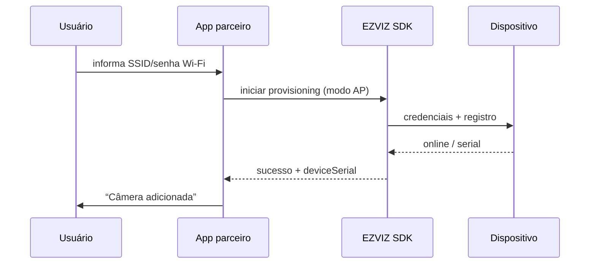

# Configuração Wi-Fi (Android)

<!-- source: packages/crawler/docs/sdk/Android SDK/Android 配网/AP配网.md -->
<!-- source: packages/crawler/docs/sdk/Android SDK/Android 配网/声波配网.md -->
<!-- source: packages/crawler/docs/sdk/Android SDK/Android 配网/有线配网.md -->

Ao concluir este capítulo, você será capaz de:

- Escolher o modo de provisioning adequado (AP, sonic, wired).
- Conduzir o usuário pelo fluxo de adicionar dispositivo à rede e à conta.
- Recuperar de falhas comuns (senha Wi-Fi, permissões, timeout).
- Posicionar provisioning no jornada do app (antes ou depois do primeiro preview).

> **Escopo:** provisioning é **nativo** (Android/iOS). A Parte Web não substitui estes fluxos — ver [matriz](../part-01-shared-concepts/02-glossary-capability-matrix.md).

## Quando usar provisioning

| Momento | Caso |
|---------|------|
| **Antes do primeiro preview** | Usuário compra câmera nova e ainda não há serial na conta |
| **Após login** | Dispositivo na caixa; app guia “Adicionar câmera” |
| **Troca de rede** | Câmera mudou de Wi-Fi — refazer modo compatível |

Após sucesso, o serial aparece na lista de dispositivos — então [preview](02-live-preview.md) e [auth](01-auth.md) aplicam-se normalmente.

## Modos suportados (corpus Android)

| Modo | Ideia | Quando preferir |
|------|-------|-----------------|
| **AP (Soft AP)** | Telefone conecta temporariamente ao Wi-Fi do dispositivo | Modelos e firmware que expõem hotspot de configuração |
| **Sonic (声波)** | App envia credenciais via áudio para o dispositivo | Ambientes sem troca manual de Wi-Fi do telefone |
| **Wired (有线)** | Dispositivo na Ethernet durante pareamento | Câmeras com porta LAN; instalações fixas |

Consulte a documentação da **versão exata** do AAR para saber quais modos seu modelo de hardware suporta — nem todo dispositivo aceita os três.

## Fluxo genérico (AP como referência)

1. **Permissões** — localização (Android 10+ para scan Wi-Fi em alguns fluxos), Bluetooth se o SDK exigir para descoberta.
2. **Credenciais Wi-Fi** — SSID e senha da rede doméstica do usuário (UI clara, sem logar senha).
3. **Modo configuração** — SDK coloca o dispositivo em estado de pareamento (LED piscando, etc.).
4. **Troca de rede temporária** — usuário conecta ao AP do dispositivo quando o SO solicitar.
5. **Envio de credenciais** — SDK transmite SSID/senha ao equipamento.
6. **Registro na conta** — dispositivo online na nuvem; serial vinculado ao `accessToken` atual.
7. **Retorno ao Wi-Fi doméstico** — app reconecta o telefone à internet.

## Modo sonic (acústico)

- Requer ambiente com ruído controlado (volume do telefone adequado).
- Informe o usuário para aproximar o telefone do dispositivo.
- Falha comum: microfone bloqueado ou usuário interrompeu — permitir retry.

## Modo wired

- Cabo Ethernet conectado antes de iniciar o fluxo no app.
- Útil quando Wi-Fi do dispositivo ainda não está configurado mas há link LAN.
- Após online, o dispositivo pode continuar em Ethernet ou migrar para Wi-Fi conforme produto.

## Falhas e recuperação

| Sintoma | Ação |
|---------|------|
| Timeout | Verificar senha Wi-Fi (2,4 GHz vs 5 GHz — muitos modelos só 2,4 GHz) |
| Não encontra dispositivo | Bluetooth/localização ligados; reset de fábrica conforme manual |
| Usuário cancelou troca de Wi-Fi | Reiniciar fluxo do passo 3 |
| Serial não aparece na conta | Confirmar mesmo `accessToken` / conta EZVIZ |
| Provisioning OK mas preview falha | Seguir [preview](02-live-preview.md) — auth e host EZOpen |

## Relação com outras partes

- **Web:** sem capítulo equivalente de provisioning — direcione usuários ao app nativo.
- **iOS:** mesma estrutura de capítulo (`06-wifi-config.md`) para paridade de produto.

## Referências cruzadas

- [Autenticação](01-auth.md) — conta e token antes/depois do pareamento
- [Preview](02-live-preview.md) — primeiro vídeo após serial na lista
- [Integração geral](../part-05-best-practices/02-general-integration.md) — testes antes de go-live

## Checklist de verificação (fechamento)

- [ ] Modo de provisioning escolhido conforme modelo de hardware.
- [ ] Permissões Android solicitadas com rationale ao usuário.
- [ ] Senha Wi-Fi nunca logada em texto claro.
- [ ] Fluxo de retry após timeout documentado no suporte.
- [ ] Após sucesso, serial visível e preview testado na mesma conta.
