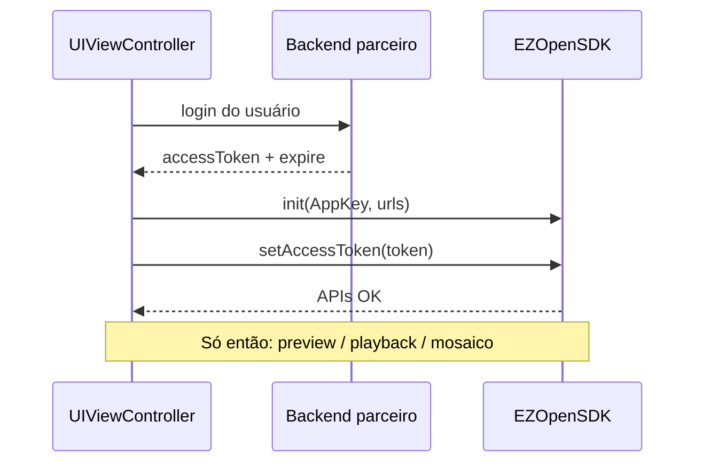

# Autenticação (iOS)

<!-- source: packages/crawler/docs/sdk/iOS SDK/iOS 集成/iOS CocoaPods安装.md -->
<!-- source: packages/crawler/docs/sdk/iOS SDK/iOS 集成/iOS-SDK初始化.md -->
<!-- source: packages/crawler/docs/sdk/iOS SDK/iOS 集成/iOS-权限设置.md -->

Ao concluir este capítulo, você será capaz de:

- Integrar o EZOpenSDK no app iOS do parceiro (CocoaPods ou framework estático, permissões no `Info.plist`).
- Inicializar o SDK com AppKey e URLs de ambiente (Open Platform pública ou híbrida).
- Aplicar `accessToken` obtido do backend do parceiro e validar a sessão antes de vídeo.
- Renovar token e recuperar de falhas de auth sem loops infinitos.

> Conceitos compartilhados (AppKey, AppSecret, ciclo de vida): [Autenticação (conceitos compartilhados)](../part-01-shared-concepts/01-auth.md).

## Pré-requisitos

- Conta de desenvolvedor na [EZVIZ Open Platform](https://open.ezviz.com) com **AppKey** registrada.
- **Backend do parceiro** capaz de trocar AppSecret por `accessToken` (AppSecret **nunca** no binário do app).
- Xcode e deployment target conforme a versão do SDK oficial que você integrou (consulte release notes no portal EZVIZ).

## Integração do SDK

1. **CocoaPods** — adicione o pod indicado na documentação oficial da sua versão (`pod install`) **ou** importe o framework estático conforme o pacote baixado no portal (leia `README(集成必读).txt` do pacote antes de integrar).
2. Vincule frameworks do sistema exigidos pelo SDK (mídia, rede, telefonia, etc.) e configure **Other Linker Flags** `-ObjC` conforme o guia oficial.
3. Desative **Bitcode** no target se a versão do SDK exigir (comum em integrações legadas).

Permissões típicas no `Info.plist` (ajuste ao escopo do produto):

| Chave / uso | Quando |
|-------------|--------|
| Acesso à rede local | Provisioning AP e descoberta em LAN (iOS 14+) |
| `NSCameraUsageDescription` | QR ou fluxos que usam câmera do iPhone |
| `NSMicrophoneUsageDescription` | Intercom / talk |
| Localização | Alguns fluxos de scan Wi-Fi — só se o SDK da sua versão exigir |

## Inicialização do SDK

Ordem recomendada no `AppDelegate` / `@main` ou na primeira tela que usa EZVIZ:

1. **`initLibWithAppKey`** (ou `EZGlobalSDK` para regiões internacionais, conforme documentação) com a AppKey do parceiro.
2. **URLs de ambiente** — Open Platform **China**: valores padrão internos (`open.ezviz.com` / `openauth.ys7.com`). Para **nuvem híbrida**, informe `apiUrl` e `authUrl` do contrato EZVIZ.
3. **`setAccessToken`** com o token retornado pelo backend **depois** que o usuário estiver autenticado no seu app.

> **Exemplo (não obrigatório):** domínio `https://hybridcloud.emivecloud.com` e auth `https://authhybridcloud.emivecloud.com` — substitua pelos endpoints do **seu** ambiente.

### Modo AccessToken (v1)

O corpus oficial descreve o modo **AccessToken** como caminho padrão para integradores parceiros: o app recebe `accessToken` + tempo de expiração do seu servidor e repassa ao SDK. Modos de token restrito (TKToken / streamToken) exigem backend adicional — fora do happy path deste guia.

## Validação da sessão

Antes de abrir preview ou playback:

1. Chame um endpoint leve do SDK ou API de dispositivos (ex.: lista de câmeras da conta — equivalente ao fluxo de validação do Demo oficial).
2. Se retornar sucesso, prossiga para montar URIs [EZOpen](../part-01-shared-concepts/00-ezopen-protocol.md).
3. Se retornar erro de autorização, **não** monte `ezopen://` — solicite novo token ao backend.

As URIs `ezopen://` usam host fixo **`open.ezviz.com`**; a URL de domínio configura o SDK separadamente (ver [Referência EZOpen](../part-01-shared-concepts/00-ezopen-protocol.md)).

## Ciclo de vida no app iOS

| Evento iOS | Ação |
|------------|------|
| `viewDidLoad` da tela de vídeo | Garantir token válido; se ausente, redirecionar para login |
| Token próximo do `expire` | Renovar via backend **antes** de sessão longa (mosaico) |
| `viewWillDisappear` / dismiss | Não confundir com teardown do player — players têm capítulo próprio |
| Logout do usuário | Limpar token em memória; chamar APIs de logout do SDK se documentadas |

## Falhas comuns

| Sintoma | Causa provável | Correção |
|---------|----------------|----------|
| Lista de dispositivos vazia com erro | Token inválido ou expirado | Renovar `accessToken` |
| Preview sem imagem, APIs OK | `apiUrl`/auth desalinhados ao token | Conferir par domínio/auth do contrato; URI EZOpen com `open.ezviz.com` |
| Erro de auth no SDK | AppKey errada ou região (China vs internacional) | Conferir `EZOpenSDK` vs `EZGlobalSDK` |
| Crash na init | Frameworks do sistema ausentes ou Bitcode | Conferir checklist de integração do pacote |

## Segurança

- Não armazene AppSecret no app; ofuscação **não** substitui arquitetura segura.
- Em logs de debug, mascare `accessToken` (ex.: últimos 4 caracteres).
- Detalhes: [Segurança](../part-05-best-practices/03-security.md).

## Referências cruzadas

- [EZOpen](../part-01-shared-concepts/00-ezopen-protocol.md) — após auth válida
- [Visualização ao vivo](02-live-preview.md) — próximo passo típico
- [Matriz de capacidades](../part-01-shared-concepts/02-glossary-capability-matrix.md)

## Checklist de verificação (fechamento)

- [ ] AppKey no cliente; AppSecret apenas no servidor.
- [ ] `initLibWithAppKey` + URLs corretas para o ambiente (público ou híbrido).
- [ ] `setAccessToken` testado com chamada de API/dispositivos antes de vídeo.
- [ ] Fluxo de renovação de token implementado (sem retry infinito do mesmo token).
- [ ] URIs EZOpen documentadas para QA com host `open.ezviz.com`; domínio híbrido só no init do SDK.
