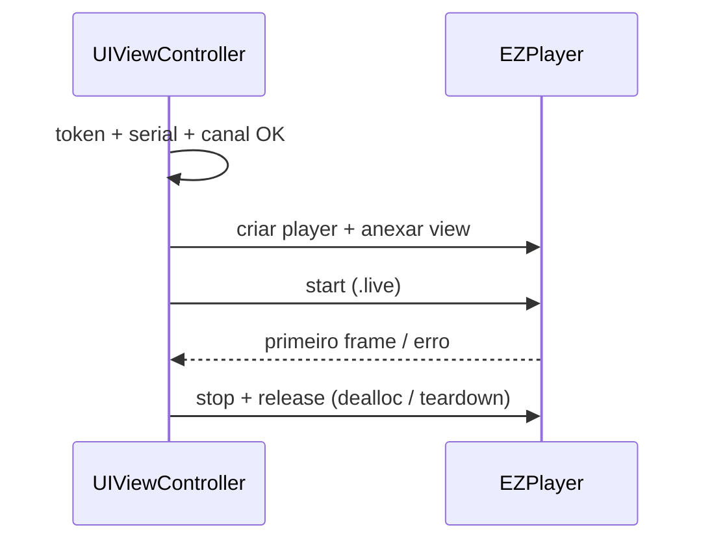

# Visualização ao vivo (iOS)

<!-- source: packages/crawler/docs/sdk/iOS SDK/iOS 预览/直播.md -->
<!-- source: packages/crawler/docs/sdk/iOS SDK/iOS 预览/取流方式.md -->

Ao concluir este capítulo, você será capaz de:

- Exibir preview ao vivo de um canal após sessão autenticada.
- Montar ou validar URI `ezopen://…/{channel}.live` conforme [Part I](../part-01-shared-concepts/00-ezopen-protocol.md).
- Gerenciar ciclo de vida do player (`EZPlayer` ou equivalente da sua versão).
- Diagnosticar falhas típicas (token, offline, canal, host, modo de stream).

## Pré-requisitos

- [Autenticação (iOS)](01-auth.md) concluída — `accessToken` válido.
- **Serial do dispositivo** e **número do canal** conhecidos (lista de dispositivos do SDK ou backend do parceiro).
- Layout com **view de vídeo** (`UIView` / player view documentado no SDK) com constraints que resultem em área > 0.

## URI EZOpen para preview

Forma (detalhes em [Referência EZOpen](../part-01-shared-concepts/00-ezopen-protocol.md)):

```text
ezopen://open.ezviz.com/{deviceSerial}/{channel}.live
```

| Campo | Origem no app |
|-------|----------------|
| `open.ezviz.com` | Host fixo do protocolo EZOpen |
| `{verificationCode}@` | Opcional — câmera criptografada; ver [EZOpen § criptografia](../part-01-shared-concepts/00-ezopen-protocol.md#câmeras-com-criptografia-código-de-verificação) |
| `{deviceSerial}` | Dispositivo selecionado |
| `{channel}` | Canal lógico (geralmente `1`) |

> **Exemplo (placeholders):** `ezopen://open.ezviz.com/C12345678/1.live`

### SDK monta a URI vs integrador explícito

| Abordagem | Quando usar |
|-----------|-------------|
| **API que recebe serial + canal** | Telas simples; SDK monta endereço internamente |
| **URI explícita** | Mosaico, troca rápida de canal, ou quando a versão expõe URL de play diretamente |

Em ambos os casos o integrador deve garantir **serial + canal + token + host** coerentes.

### Modos de stream (corpus iOS)

O SDK pode usar **LAN direto**, **P2P** e **streaming** (VTDU). Por padrão LAN + streaming estão ativos; P2P é opcional. **Não desative streaming** sem orientação EZVIZ — reduz taxa de sucesso. Prioridade típica quando todos ativos: LAN > P2P > streaming.

## Fluxo feliz (happy path)

1. **Auth pronta** — token validado (lista de dispositivos ou ping leve).
2. **Montar layout** — player view visível com dimensões > 0.
3. **Obter contexto** — serial e canal do dispositivo escolhido.
4. **Iniciar preview** — criar player, associar à view, passar endereço `.live` (ou parâmetros serial/canal) e token da sessão.
5. **Callback de primeiro frame** — indicador de carregamento até primeiro frame ou erro.
6. **Parar ao sair** — `stop` + liberar player na destruição da tela.



## Ciclo de vida iOS

| Callback | Ação no player |
|----------|----------------|
| App em background | Política do produto: pausar stream ou manter (bateria vs UX) |
| `viewWillDisappear` | Recomendado **parar** stream se a tela não estiver visível |
| `deinit` / teardown explícito | **Obrigatório:** `stop` + liberar player |
| Troca de dispositivo na mesma tela | Parar player atual antes de novo serial/canal |

Não empilhe view controllers de vídeo mantendo decoders ativos sem política explícita — causa vazamento e falha na segunda visita.

## Modos de falha

| Sintoma | Verificação |
|---------|-------------|
| Tela preta, sem erro | Constraints zero; player não anexado |
| Erro de autorização | Token expirado — renovar antes de retentar URI |
| Dispositivo offline | Estado na lista de dispositivos; rede do equipamento |
| Canal inválido | Canal inexistente no NVR/câmera |
| Domínio/auth incorretos | `apiUrl`/auth do SDK desalinhados ao token |
| Sufixo errado | `.rec` usado para intenção de live |

## Áudio no preview

Se o produto exige áudio ao vivo, habilite conforme API do player da sua versão. Intercom bidirecional é tratado em [Controle de dispositivo](04-device-control.md).

## Referências cruzadas

- [Referência EZOpen](../part-01-shared-concepts/00-ezopen-protocol.md) — `.live`, host, validação
- [Reprodução](03-playback.md) — trocar `.live` por `.rec`
- [Mosaico](05-mosaic.md) — vários previews simultâneos
- [Desempenho e mosaico](../part-05-best-practices/01-mosaic-performance.md) — limites de decoders

## Checklist de verificação (fechamento)

- [ ] Preview só inicia após `accessToken` validado.
- [ ] URI `.live` usa host `open.ezviz.com`.
- [ ] Teardown da tela sempre libera o player.
- [ ] Troca de canal/dispositivo para o stream anterior antes do novo.
- [ ] Erros de token disparam renovação, não retry infinito da mesma URI.
