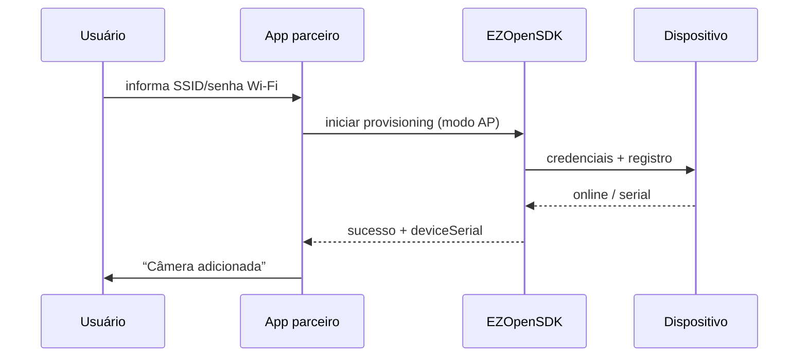

# Configuração Wi-Fi (iOS)

<!-- source: packages/crawler/docs/sdk/iOS SDK/iOS 配网/AP配网.md -->
<!-- source: packages/crawler/docs/sdk/iOS SDK/iOS 配网/声波配网&一般配网.md -->
<!-- source: packages/crawler/docs/sdk/iOS SDK/iOS 配网/网线配网.md -->

Ao concluir este capítulo, você será capaz de:

- Escolher o modo de provisioning adequado (AP, sonic, Smart, wired).
- Conduzir o usuário pelo fluxo de adicionar dispositivo à rede e à conta.
- Recuperar de falhas comuns (senha Wi-Fi, permissões, timeout).
- Posicionar provisioning no jornada do app (antes ou depois do primeiro preview).

> **Escopo:** provisioning é **nativo** (Android/iOS). A Parte Web não substitui estes fluxos — ver [matriz](../part-01-shared-concepts/02-glossary-capability-matrix.md).

## Quando usar provisioning

| Momento | Caso |
|---------|------|
| **Antes do primeiro preview** | Usuário compra câmera nova e ainda não há serial na conta |
| **Após login** | Dispositivo na caixa; app guia “Adicionar câmera” |
| **Troca de rede** | Câmera mudou de Wi-Fi — refazer modo compatível |

Após sucesso, o serial aparece na lista de dispositivos — então [preview](02-live-preview.md) e [auth](01-auth.md) aplicam-se normalmente.

## Modos suportados (corpus iOS)

| Modo | Ideia | Quando preferir |
|------|-------|-----------------|
| **AP (Soft AP)** | iPhone conecta temporariamente ao hotspot do dispositivo | Modelos com hotspot de configuração |
| **Sonic (声波)** | Credenciais transmitidas por áudio | Evitar troca manual de Wi-Fi do telefone |
| **Smart (provisioning automático)** | SDK escolhe modo automaticamente | Primeira tentativa; fallback para AP/sonic |
| **接触式 AP** | Dispositivos sem vídeo (radar, alimentador) | Hardware específico — ver capability set |
| **Wired (网线)** | Ethernet conectada; `addDevice` após registro na plataforma | Instalações fixas com LAN |

Consulte **capability set** do dispositivo (`probeDeviceInfo` no corpus) antes de exibir opções — nem todo modelo aceita todos os modos.

## Fluxo genérico (AP como referência)

1. **Permissões** — localização e **rede local** (iOS 14+) quando exigido; Bluetooth se o SDK pedir descoberta.
2. **Credenciais Wi-Fi** — SSID e senha da rede doméstica (UI clara, sem logar senha).
3. **Modo configuração** — SDK coloca o dispositivo em pareamento (LED, etc.).
4. **Troca de rede temporária** — usuário segue prompts do sistema para conectar ao AP do dispositivo.
5. **Envio de credenciais** — SDK transmite SSID/senha.
6. **Registro na conta** — dispositivo online; serial vinculado ao `accessToken` atual.
7. **Retorno ao Wi-Fi doméstico** — app reconecta o iPhone à internet.

## Modo sonic (acústico)

- Ambiente com ruído controlado e volume adequado do iPhone.
- Aproximar o telefone do dispositivo conforme instruções do SDK.
- Falha comum: microfone bloqueado — permitir retry.

## Modo wired

- Cabo Ethernet antes de iniciar o fluxo no app.
- Após registro na plataforma, vincular com API de adicionar dispositivo documentada na sua versão.
- Útil quando Wi-Fi do dispositivo ainda não está configurado mas há link LAN.

## Falhas e recuperação

| Sintoma | Ação |
|---------|------|
| Timeout | Senha Wi-Fi; **2,4 GHz** vs 5 GHz (muitos modelos só 2,4 GHz) |
| Não encontra dispositivo | Rede local / Bluetooth; reset conforme manual |
| Usuário cancelou troca de Wi-Fi | Reiniciar do passo de pareamento |
| Serial não aparece na conta | Mesmo `accessToken` / conta EZVIZ |
| Provisioning OK mas preview falha | [preview](02-live-preview.md) — auth e host EZOpen |

## Paridade Android (diferenças intencionais)

| Tópico | Android | iOS |
|--------|---------|-----|
| Permissão de localização | Obrigatória em vários fluxos de scan Wi-Fi | Rede local + localização conforme versão iOS |
| Provisioning Smart automático | Corpus Android separa sonic/AP/wired | iOS documenta **Smart** como primeira linha no corpus |
| Demo instalável | APK de demonstração | App Demo requer certificado do parceiro |

## Referências cruzadas

- [Autenticação](01-auth.md) — conta e token antes/depois do pareamento
- [Preview](02-live-preview.md) — primeiro vídeo após serial na lista
- [Integração geral](../part-05-best-practices/02-general-integration.md) — testes antes de go-live
- [Configuração Wi-Fi (Android)](../part-02-android/06-wifi-config.md) — paridade de produto

## Checklist de verificação (fechamento)

- [ ] Modo de provisioning escolhido conforme capability set do hardware.
- [ ] Permissões iOS solicitadas com texto de uso claro no `Info.plist`.
- [ ] Senha Wi-Fi nunca logada em texto claro.
- [ ] Fluxo de retry após timeout documentado no suporte.
- [ ] Após sucesso, serial visível e preview testado na mesma conta.
