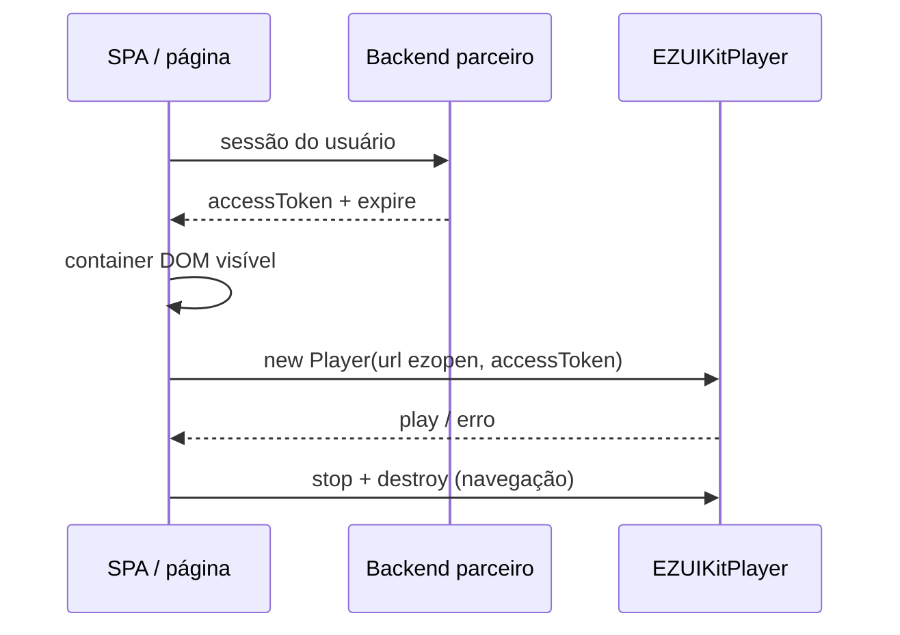

# Autenticação (Web)

<!-- source: packages/crawler/docs/sdk/轻应用EZUIKit Web SDK/EZUIKit SDK概述.md -->
<!-- source: packages/crawler/docs/sdk/轻应用EZUIKit Web SDK/UIKit-js 集成.md -->

Ao concluir este capítulo, você será capaz de:

- Integrar **EZUIKit** (`ezuikit-js`) na aplicação Web do parceiro.
- Obter e repassar `accessToken` do backend sem expor AppSecret no browser.
- Configurar URL de domínio (propriedade opcional **separada** do `url` EZOpen) e auth conforme o contrato EZVIZ.
- Validar sessão antes de criar players de preview ou playback.

> Conceitos compartilhados (AppKey, AppSecret, ciclo de vida): [Autenticação (conceitos compartilhados)](../part-01-shared-concepts/01-auth.md).

## Pré-requisitos

- Conta na [EZVIZ Open Platform](https://open.ezviz.com) com **AppKey** registrada.
- **Backend do parceiro** que troca AppSecret por `accessToken` (AppSecret **nunca** no front-end público).
- Projeto Web com bundler (Vite, Webpack, etc.) ou página estática capaz de importar módulos npm.

## Instalação do EZUIKit

1. Adicione a dependência oficial (nome do pacote conforme release no portal EZVIZ):

   ```bash
   npm install ezuikit-js
   ```

2. Importe o player no módulo da tela de vídeo (ex.: `import EZUIKit from 'ezuikit-js'` ou export nomeado `EZUIKitPlayer` — siga a nota de release da sua versão).
3. Garanta que a página serve **HTTPS** em produção (requisito comum de getUserMedia e políticas do browser para integrações de vídeo).

> **ADR-003:** este guia usa **EZUIKit** como stack Web canônica. SDK de fluxo padrão (FLV/HLS) fica fora do happy path v1.

## Credenciais no browser

| Item | Onde fica | Uso no Web |
|------|-----------|------------|
| AppKey | Config do app / env build | Identificação do produto; pode ser pública no cliente |
| AppSecret | **Somente backend** | Troca por token |
| accessToken | Backend → front-end | Parâmetro `accessToken` de cada instância EZUIKit |
| URL de auth / domínio | Backend + init EZUIKit (`domain` ou equivalente, se o contrato exigir) | Endpoints de API/auth; **não** entram no host da URI `ezopen://` |

Fluxo:

1. Usuário autentica no **seu** produto.
2. Front-end chama **seu** backend.
3. Backend chama o centro de auth EZVIZ e devolve `accessToken` + expiração.
4. Front-end só então monta players com `accessToken` e URIs `ezopen://`.

## Validação da sessão (antes de vídeo)

Antes de instanciar `EZUIKitPlayer`:

1. Chame um endpoint leve (lista de dispositivos via API REST do parceiro ou proxy no seu backend).
2. Se autorizado, prossiga para [Visualização ao vivo](02-live-preview.md).
3. Se erro 401/403, **não** monte `ezopen://` — solicite novo token ao backend.

As URIs passadas em `url` ao EZUIKit usam host fixo **`open.ezviz.com`** (ver [Referência EZOpen](../part-01-shared-concepts/00-ezopen-protocol.md)). Quando o contrato exige nuvem híbrida ou domínio customizado, configure a **URL de domínio** em propriedade **separada** do player ou do init global (nome exato conforme a versão do EZUIKit — frequentemente `domain` ou opção equivalente de ambiente), alinhada ao par auth/domínio do seu backend. **Não** coloque o hostname híbrido dentro de `ezopen://`.

## Ciclo de vida no app Web



| Evento | Ação |
|--------|------|
| Entrar na rota de vídeo | Garantir token válido; se ausente, redirecionar para login |
| Token próximo do expire | Renovar via backend **antes** de mosaico longo |
| Sair da rota / desmontar componente | `stop()` + `destroy()` em **todos** os players da tela |
| Troca de usuário | Destruir players; limpar token em memória |

## Modos de falha (auth)

| Sintoma | Verificação |
|---------|-------------|
| Player falha imediatamente | Token ausente ou expirado |
| APIs OK, vídeo não | `domain`/auth do EZUIKit desalinhados ao token; ou URI EZOpen sem `open.ezviz.com` |
| CORS / rede | Backend e domínio EZVIZ permitidos na configuração do app |
| AppSecret no bundle | Remover — risco de segurança |

## Web vs Android/iOS (auth)

| Tópico | Nativo | Web (este capítulo) |
|--------|--------|---------------------|
| AppSecret | Nunca no app | Nunca no browser |
| `setAccessToken` no SDK global | Sim (Android/iOS) | Token por instância do player EZUIKit |
| Validação pré-vídeo | Lista de dispositivos | Idem via API/backend |
| Provisioning Wi-Fi | Nativo | Ver [Wi-Fi](06-wifi-config.md) — não aplicável no browser |

## Referências cruzadas

- [Referência EZOpen](../part-01-shared-concepts/00-ezopen-protocol.md) — host `open.ezviz.com`, `.live`, `.rec`
- [Preview ao vivo](02-live-preview.md) — container DOM + URI
- [Matriz de capacidades](../part-01-shared-concepts/02-glossary-capability-matrix.md)

## Checklist de verificação (fechamento)

- [ ] AppSecret permanece apenas no servidor.
- [ ] Preview/playback só após `accessToken` validado.
- [ ] URIs `ezopen://` usam `open.ezviz.com`; domínio híbrido (se houver) só na propriedade `domain`/init, não no `url`.
- [ ] Players destruídos ao sair da rota.
- [ ] HTTPS em produção.
