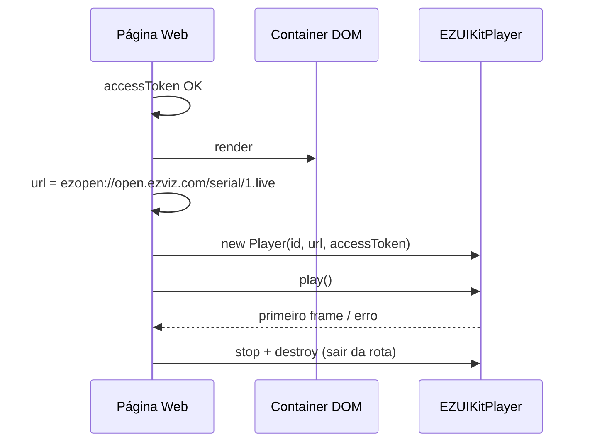

# Visualização ao vivo (Web)

<!-- source: packages/crawler/docs/sdk/轻应用EZUIKit Web SDK/UIKit SDK 功能API/直播/ezuikit-js 预览.md -->
<!-- source: packages/crawler/docs/sdk/轻应用EZUIKit Web SDK/UIKit-js 集成.md -->

Ao concluir este capítulo, você será capaz de:

- Montar URI `ezopen://…/{channel}.live` conforme [Referência EZOpen](../part-01-shared-concepts/00-ezopen-protocol.md).
- Fornecer **container DOM** com dimensões visíveis e associar o player EZUIKit.
- Executar a sequência de init: auth → container → URL + `accessToken` → play.
- Diagnosticar falhas típicas (token, domínio EZUIKit, container, offline).

## Pré-requisitos

- [Autenticação (Web)](01-auth.md) — `accessToken` válido no contexto da página.
- **Serial** e **canal** do dispositivo (lista via backend ou API EZVIZ).
- Elemento HTML reservado para o vídeo (`id` estável, largura e altura > 0).

## URI EZOpen para preview

Forma completa (detalhes em [Referência EZOpen](../part-01-shared-concepts/00-ezopen-protocol.md)):

```text
ezopen://open.ezviz.com/{deviceSerial}/{channel}.live
```

| Campo | Origem |
|-------|--------|
| `open.ezviz.com` | Host fixo do protocolo EZOpen |
| `{verificationCode}@` | Opcional — antes do host, se a câmera exige criptografia (ver [Referência EZOpen](../part-01-shared-concepts/00-ezopen-protocol.md#câmeras-com-criptografia-código-de-verificação)) |
| `{deviceSerial}` | Dispositivo selecionado |
| `{channel}` | Canal lógico (geralmente `1`) |

> **Exemplo (placeholders):** `ezopen://open.ezviz.com/C12345678/1.live`  
> **Câmera criptografada:** `ezopen://YOUR_VERIFY_CODE@open.ezviz.com/C12345678/1.live`

No Web, essa string é passada **integralmente** na opção `url` do construtor EZUIKit, junto com `accessToken` — não basta serial/canal soltos.

## Container DOM (obrigatório)

O integrador **deve** preparar o mount antes de criar o player:

| Requisito | Motivo |
|-----------|--------|
| Elemento existente no DOM (`<div id="player-live">` ou equivalente) | EZUIKit renderiza dentro do `id` informado |
| Largura e altura > 0 (CSS ou atributos) | Container com tamanho zero → tela preta |
| `id` único por instância | Mosaico: um container por tile |
| Montar após o layout (ex.: `useEffect`, `onMounted`) | Evitar criar player antes do elemento existir |

Exemplo estrutural (ilustrativo — ajuste à sua versão do SDK):

```html
<div id="ezopen-live-container" style="width: 640px; height: 360px;"></div>
```

```javascript
// Após accessToken válido e DOM pronto:
const url = "ezopen://open.ezviz.com/C12345678/1.live";
const player = new EZUIKitPlayer({
  id: "ezopen-live-container",
  url,
  accessToken: YOUR_ACCESS_TOKEN,
  width: 640,
  height: 360,
});
player.play();
```

## Sequência de inicialização (ordenada)

Siga esta ordem em produção:

1. **Auth pronta** — `accessToken` obtido do backend e ainda dentro do `expire`.
2. **Container no DOM** — elemento visível com dimensões definidas.
3. **Montar URL EZOpen** — string `ezopen://open.ezviz.com/…/.live` (host fixo).
4. **Criar player** — `new EZUIKitPlayer({ id, url, accessToken, … })`.
5. **Play** — `player.play()` (ou auto-play conforme template da versão).
6. **Tratar erro** — callback/evento de falha; renovar token se auth, não retry infinito.



## Web vs nativo (preview)

| Aspecto | Android / iOS | Web (EZUIKit) |
|---------|---------------|---------------|
| URI `ezopen://` | SDK pode montar internamente | **String explícita** em `url` |
| Superfície de vídeo | View SDK na hierarquia | **Container DOM** fornecido pelo integrador |
| Token | `setAccessToken` global | `accessToken` no construtor |
| Ciclo de vida | `onDestroy` + release | `destroy()` ao desmontar rota/componente |
| Áudio / talk | Capítulo de controle | [Controle de dispositivo](04-device-control.md) |

## Ciclo de vida na SPA

| Evento | Ação no player |
|--------|----------------|
| Troca de dispositivo/canal | `stop` + `destroy` → nova URI → novo player ou `changePlayUrl` |
| Navegação para outra rota | **Obrigatório:** `destroy()` — evita vazamento WebGL/canvas |
| Aba em background | Política do produto: parar stream ou aceitar desconexão |
| Resize do layout | Ajustar `width`/`height` conforme API da versão; evitar múltiplos players no mesmo `id` |

## Modos de falha

| Sintoma | Verificação |
|---------|-------------|
| Tela preta, sem erro | Container com altura/largura zero; player criado antes do DOM |
| Erro de autorização | `accessToken` expirado — renovar no backend |
| Dispositivo offline | Estado na lista de dispositivos |
| Domínio/auth incorretos | `domain` do EZUIKit ou endpoints de backend desalinhados ao token |
| Sufixo errado | `.rec` usado para intenção de live |
| Múltiplos players no mesmo `id` | Um container por instância |

## Referências cruzadas

- [Referência EZOpen](../part-01-shared-concepts/00-ezopen-protocol.md) — `.live`, host `open.ezviz.com`, validação
- [Reprodução](03-playback.md) — trocar `.live` por `.rec`
- [Mosaico](05-mosaic.md) — vários containers e URIs
- [Desempenho e mosaico](../part-05-best-practices/01-mosaic-performance.md) — limites Web

## Checklist de verificação (fechamento)

- [ ] Preview só inicia após `accessToken` validado.
- [ ] URI `.live` usa host `open.ezviz.com`; domínio híbrido (se houver) só em `domain`/init EZUIKit.
- [ ] Container DOM existe, visível e com tamanho > 0 antes do construtor.
- [ ] `url` contém `ezopen://` completo e sufixo `.live`.
- [ ] `destroy()` ao sair da rota.
- [ ] Troca de canal/dispositivo destrói ou altera player antes do novo stream.
