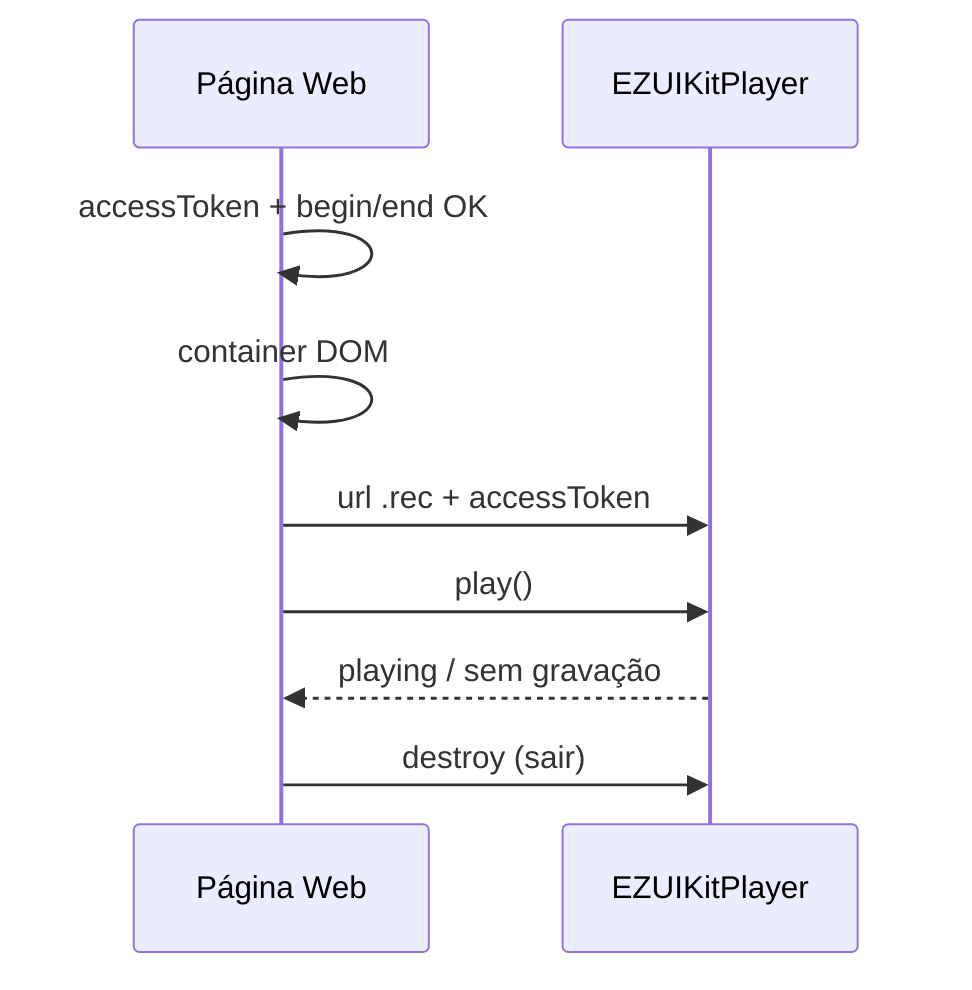

# Reprodução (Web)

<!-- source: packages/crawler/docs/sdk/轻应用EZUIKit Web SDK/UIKit SDK 功能API/回放/ezuikit-js 回放.md -->

Ao concluir este capítulo, você será capaz de:

- Reproduzir gravação na **nuvem** via URI `ezopen://…/.rec` com `begin` e `end`.
- Reutilizar as regras de **container DOM** e `accessToken` do preview.
- Alternar entre `.live` e `.rec` sem vazar instâncias do player.
- Reconhecer que playback de cartão SD é **somente nativo** (ADR-005).

> **Escopo v1 (ADR-005):** Web documenta **apenas playback na nuvem** (`.rec`). Playback local (SD) está em [Android](../part-02-android/03-playback.md) e [iOS](../part-03-ios/03-playback.md).

## Pré-requisitos

- [Autenticação (Web)](01-auth.md) e familiaridade com [preview ao vivo](02-live-preview.md).
- Dispositivo com gravação na nuvem ativada.
- UI para intervalo de tempo ou lista de clipes (API/backend do parceiro).

## URI EZOpen para playback na nuvem

Forma completa (ver [Referência EZOpen](../part-01-shared-concepts/00-ezopen-protocol.md)):

```text
ezopen://open.ezviz.com/{deviceSerial}/{channel}.rec?begin=yyyyMMddHHmmss&end=yyyyMMddHHmmss
```

| Parâmetro | Formato | Nota |
|-----------|---------|------|
| `begin` | 14 dígitos `yyyyMMddHHmmss` | Início da janela |
| `end` | 14 dígitos | Fim da janela; deve ser ≥ `begin` |
| Sufixo | `.rec` | Gravação na nuvem — não use para live |

> **Exemplo (placeholders):** `ezopen://open.ezviz.com/C12345678/1.rec?begin=20250414080000&end=20250414100000`

## Container DOM e token

As mesmas regras do preview aplicam-se ao playback:

| Requisito | Detalhe |
|-----------|---------|
| **Container** | Elemento HTML dedicado (`id` único) com largura e altura > 0 |
| **Montar no DOM** | Criar player somente após o elemento existir na página |
| **accessToken** | Mesmo token da sessão; renovar em playback longo |
| **url** | String `ezopen://` **completa**, incluindo query `begin` e `end` |

Exemplo estrutural (ilustrativo):

```html
<div id="ezopen-rec-container" style="width: 640px; height: 360px;"></div>
```

```javascript
const url =
  "ezopen://open.ezviz.com/C12345678/1.rec?begin=20250414080000&end=20250414100000";
const player = new EZUIKitPlayer({
  id: "ezopen-rec-container",
  url,
  accessToken: YOUR_ACCESS_TOKEN,
  width: 640,
  height: 360,
});
player.play();
```

## Sequência de inicialização (playback)

1. **Auth pronta** — `accessToken` válido.
2. **Definir janela** — `begin`/`end` com gravação existente (lista de cloud record do backend).
3. **Container no DOM** — elemento visível para o player de gravação.
4. **Montar URI `.rec`** — host `open.ezviz.com`; query com 14 dígitos.
5. **Criar player** — `url` + `accessToken` + `id` do container.
6. **Play** — iniciar reprodução; tratar “sem gravação no período”.
7. **Teardown** — ao sair: `stop` + `destroy`.

Se a tela alterna entre live e gravação:

1. **Parar** o player de preview (`.live`) com `destroy`.
2. Montar nova URI `.rec` (ou usar `changePlayUrl` se a versão EZUIKit suportar sem recriar).
3. Não manter dois players no mesmo `id`.



## Playback SD (fora de escopo Web)

| Tipo | Web (EZUIKit) | Android / iOS |
|------|---------------|---------------|
| Nuvem `.rec` | **Sim** (este capítulo) | Sim |
| Cartão SD local | **Não** | Sim — capítulos nativos |

Não passe URI `.rec` de nuvem esperando ler cartão SD — pipelines distintos no SDK nativo; no Web não há API equivalente v1.

## Modos de falha

| Sintoma | Causa provável |
|---------|----------------|
| `.rec` sem vídeo | Janela `begin`/`end` sem gravação; fuso horário |
| Erro imediato | `accessToken` expirado |
| Tela preta | Container DOM com tamanho zero |
| Live em vez de gravado | Sufixo `.live` por engano |
| Domínio/auth incorretos | `domain` do EZUIKit ou backend desalinhados ao token |

## Referências cruzadas

- [Referência EZOpen](../part-01-shared-concepts/00-ezopen-protocol.md) — `.rec`, `begin`, `end`
- [Visualização ao vivo](02-live-preview.md) — container, mount, `.live`
- [Matriz de capacidades](../part-01-shared-concepts/02-glossary-capability-matrix.md) — nuvem vs SD

## Checklist de verificação (fechamento)

- [ ] Produto Web oferece apenas playback na nuvem (não promete SD).
- [ ] URIs `.rec` incluem `begin` e `end` válidos.
- [ ] Container DOM montado antes do construtor EZUIKit.
- [ ] `accessToken` e `url` passados juntos ao player.
- [ ] Troca live → rec destrói ou altera player anterior.
- [ ] `destroy()` ao sair da tela de playback.
