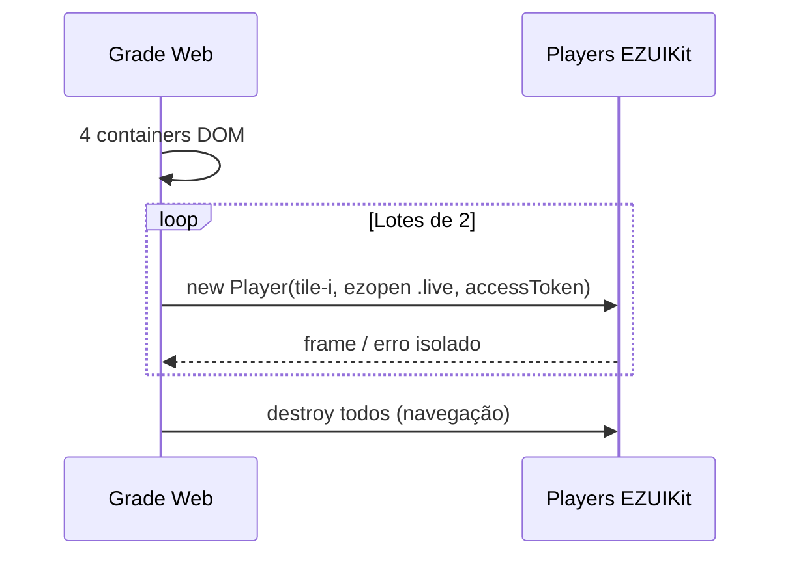

# Mosaico / multi-preview (Web)

<!-- source: packages/crawler/docs/sdk/轻应用EZUIKit Web SDK/UIKit SDK 功能API/视频巡检/ezuikit-js 视频巡检.md -->
<!-- source: ADR-006 — padrões internos ezviz_flutter_package (prosa apenas) -->

Ao concluir este capítulo, você será capaz de:

- Montar grade com vários previews `.live` simultâneos no browser.
- Aplicar a regra **um container DOM + uma URI `ezopen://` por tile**.
- Gerenciar início em lote, erros por célula e teardown ao sair da rota.
- Seguir [Desempenho e mosaico](../part-05-best-practices/01-mosaic-performance.md) antes de produção.

> **Obrigatório:** leia [Desempenho e mosaico](../part-05-best-practices/01-mosaic-performance.md) — teto de players, memória do browser e `destroy` na navegação.

## Modelo conceitual (Web)

| Conceito | Web (EZUIKit) |
|----------|---------------|
| **Pasta / grupo** | Lista lógica de câmeras no seu backend |
| **Tile (célula)** | Um `div` (ou elemento) com `id` único |
| **URI por tile** | `ezopen://open.ezviz.com/{serial}/{channel}.live` distinta por câmera |
| **Player por tile** | Uma instância `EZUIKitPlayer` por container |
| **Sessão** | Da montagem da grade até `destroy` em todos os players |

Regra PRD v1: **N tiles visíveis ⇒ N containers ⇒ N URIs `ezopen://` ⇒ até N players.** Não compartilhe o mesmo `id` DOM entre tiles.

## Layout da grade

```html
<!-- Exemplo 2×2: quatro containers distintos -->
<div class="grid">
  <div id="tile-0" class="cell"></div>
  <div id="tile-1" class="cell"></div>
  <div id="tile-2" class="cell"></div>
  <div id="tile-3" class="cell"></div>
</div>
```

Cada `.cell` precisa de CSS com largura/altura > 0. Tiles fora da viewport (scroll) devem **parar** o player, não apenas `display: none` sem `destroy`.

## Fluxo de integração

1. **Auth** — `accessToken` válido para todos os seriais da pasta.
2. **Renderizar grade** — containers no DOM antes de qualquer construtor.
3. **Montar URIs** — uma `.live` por tile (host `open.ezviz.com` em todas).
4. **Início em lote** — ex.: 2 players por vez com pequeno atraso (ver Parte V).
5. **Erro por tile** — placeholder na célula com falha; não travar a grade.
6. **Teardown** — ao sair da rota: `stop` + `destroy` em **todos** os players.



## Fullscreen (uma célula)

1. Ao expandir um tile: **destrua** ou pare players das outras células (libera GPU/memória).
2. Reutilize o player do tile ou crie instância dedicada em container fullscreen.
3. Ao sair: `destroy` do fullscreen; reinicie em lote apenas tiles visíveis.

Detalhes: [Desempenho e mosaico — fullscreen](../part-05-best-practices/01-mosaic-performance.md#transições-para-tela-cheia).

## Web vs nativo (mosaico)

| Aspecto | Android / iOS | Web |
|---------|---------------|-----|
| Superfície por célula | View SDK | **Container DOM** (`id` único) |
| URI por célula | `.live` distinta | Idem — string explícita |
| Limite prático | Decoders hardware | Players WebGL/canvas — teto menor |
| Tile removido | `stop` + release | **`destroy`** + remover nó DOM |

## O que não colar (ADR-006)

Não publique código interno de wrappers Emive. Implemente contra **EZUIKit** oficial. Referência interna opcional: `ezviz_flutter_package` (prosa apenas).

## Referências cruzadas

- [Preview ao vivo](02-live-preview.md) — mount e URI `.live`
- [Desempenho e mosaico](../part-05-best-practices/01-mosaic-performance.md) — limites e anti-padrões
- [Controle de dispositivo](04-device-control.md) — PTZ no tile em foco
- [Referência EZOpen](../part-01-shared-concepts/00-ezopen-protocol.md)

## Checklist de verificação (fechamento)

- [ ] Cada tile tem **container** próprio e URI `ezopen://` própria.
- [ ] Início em lote; não criar 9 players síncronos de uma vez.
- [ ] Saída da rota: `destroy` em todos os players.
- [ ] Fullscreen para streams das outras células.
- [ ] Link para Parte V de desempenho revisado com QA.
