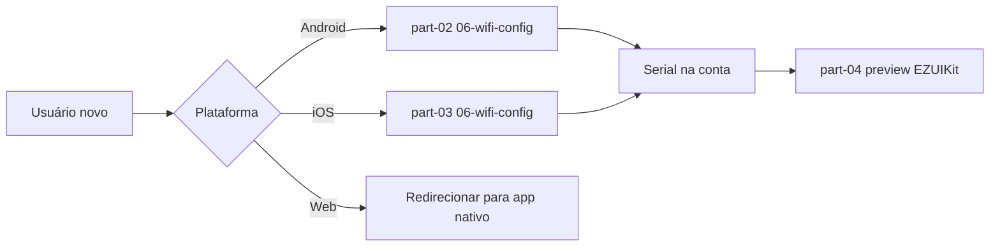

# Configuração Wi-Fi (Web)

<!-- source: packages/crawler/docs/sdk/轻应用EZUIKit Web SDK/ — sem API de provisioning Web v1 -->

Ao concluir este capítulo, você será capaz de:

- Explicar por que **provisioning Wi-Fi não está disponível** na Parte Web v1.
- Direcionar usuários e integradores para os fluxos **nativos** Android e iOS.
- Posicionar “adicionar câmera” na jornada do produto multiplataforma.

> **Escopo:** configuração de rede do dispositivo (AP, sonic, wired) é **somente nativa**. O browser não substitui os SDKs mobile de provisioning (ADR-005, matriz de capacidades).

## Por que Web não faz provisioning

| Limitação | Impacto |
|-----------|---------|
| Sem acesso ao hotspot temporário do dispositivo | Modo AP exige troca de Wi-Fi do sistema — APIs indisponíveis no browser |
| Sem sonic / BLE padronizado cross-browser | Fluxos de áudio/BLE do corpus Android/iOS não têm equivalente Web v1 |
| Segurança e UX | EZVIZ documenta provisioning nos apps nativos |

O capítulo Web existe para **evitar** que o time Web implemente provisioning incompleto. Use apps nativos ou deep links para o fluxo oficial do parceiro.

## O que fazer no produto Web

| Cenário | Ação recomendada |
|---------|------------------|
| Usuário novo sem dispositivo na conta | Botão “Adicionar câmera” → app Android/iOS ou QR para download |
| Portal Web apenas visualização | Assumir dispositivos já provisionados; [auth](01-auth.md) + [preview](02-live-preview.md) |
| Suporte | Documentar link para guias nativos abaixo |

## Fluxos nativos (referência)

Implemente provisioning nos apps mobile conforme:

- [Configuração Wi-Fi (Android)](../part-02-android/06-wifi-config.md) — AP, sonic, wired
- [Configuração Wi-Fi (iOS)](../part-03-ios/06-wifi-config.md) — AP, sonic, Smart, wired

Após sucesso no nativo, o serial aparece na conta — então a Parte Web aplica [autenticação](01-auth.md) e [preview](02-live-preview.md) normalmente.

## Web vs nativo (provisioning)

| Capacidade | Android | iOS | Web |
|------------|---------|-----|-----|
| AP / Soft AP | Sim | Sim | **Não** |
| Sonic | Sim | Sim | **Não** |
| Wired | Sim | Sim | **Não** |
| Preview após provisionar | Sim | Sim | Sim (EZOpen + EZUIKit) |

## Referências cruzadas

- [Matriz de capacidades](../part-01-shared-concepts/02-glossary-capability-matrix.md) — linha “Provisioning / rede”
- [Autenticação (Web)](01-auth.md) — após dispositivo na conta
- [Integração geral](../part-05-best-practices/02-general-integration.md) — jornada multiplataforma

## Checklist de verificação (fechamento)

- [ ] Produto Web não promete provisioning Wi-Fi in-browser v1.
- [ ] Links para capítulos Android e iOS de Wi-Fi na UX de “adicionar câmera”.
- [ ] Suporte interno sabe que serial novo exige fluxo nativo primeiro.
- [ ] Após provisionar, fluxo Web usa `accessToken` + `ezopen://` conforme Parte IV.
