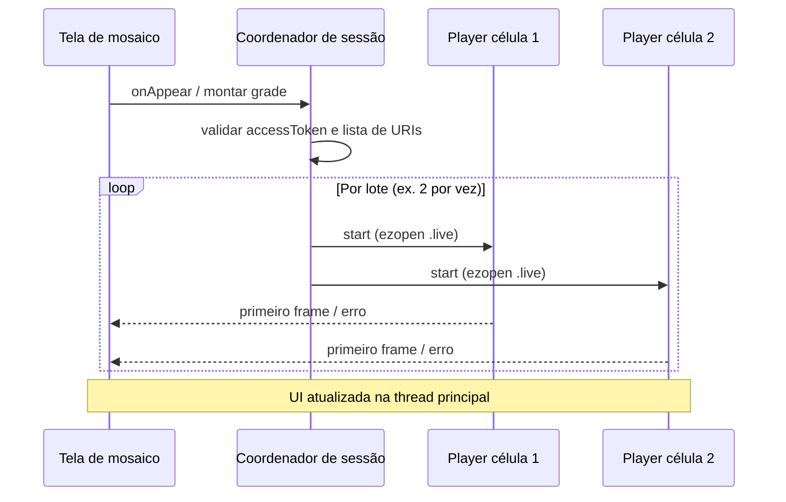
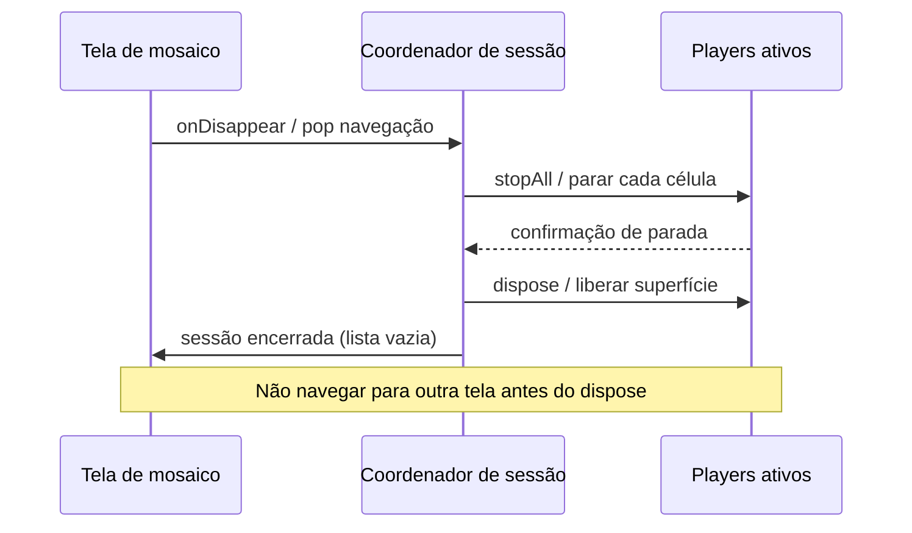
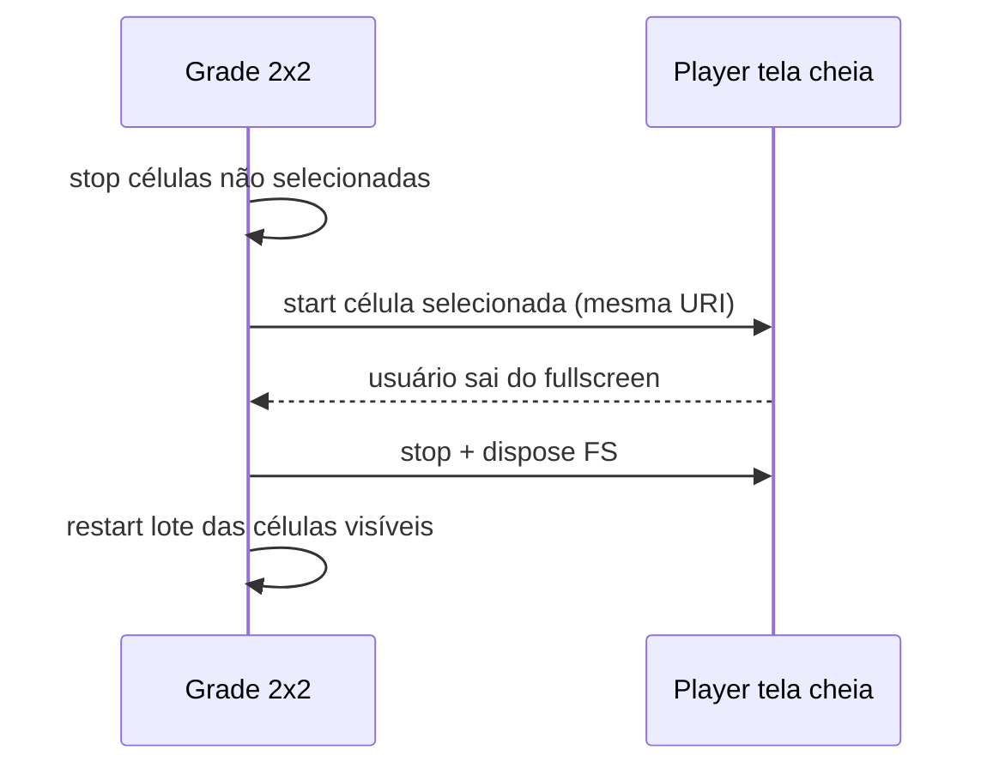

# Desempenho e mosaico

<!-- source: ADR-006; referência interna ezviz_flutter_package (mosaico multi-preview) -->

Ao concluir este capítulo, você será capaz de:

- Dimensionar quantos decoders simultâneos o dispositivo suporta em uma grade de mosaico.
- Aplicar regras de thread/UI para evitar travamentos e vazamento de players.
- Encerrar todos os streams ao sair da tela, mudar layout ou entrar em tela cheia.
- Validar o fluxo de mosaico com checklist objetivo antes de liberar em produção.

## Por que este capítulo existe

Telas com várias câmeras ao vivo multiplicam **decodificação de vídeo**, **buffers de imagem** e **callbacks de rede**. Em integrações reais (incluindo padrões validados internamente no `ezviz_flutter_package`), a maioria dos incidentes de produção vem de **não liberar players** ao navegar, de **iniciar todos os streams de uma vez** em hardware limitado ou de **atualizar UI fora da thread principal**. Este capítulo consolida o que os capítulos de plataforma (`05-mosaic.md`) referenciam — sem duplicar passos de SDK.

> **Referência interna (Emive):** fluxos de grade e fullscreen foram revisados com base em `ezviz_flutter_package` — Android: `.../EzvizMultiPreviewPlatform.kt`; iOS: `.../EzvizMultiPreviewPlatform.swift`. Parceiros implementam contra os SDKs oficiais EZVIZ; os caminhos acima servem apenas para alinhar narrativa com implementação já exercitada em campo.

## Modelo mental: pasta, grade e N players

| Conceito | Significado para o integrador |
|----------|-------------------------------|
| **Pasta / agrupamento** | Conjunto lógico de câmeras exibidas juntas (ex.: andar, planta, favoritos). |
| **Célula da grade** | Um slot visual com **um** player e **uma** URI `ezopen://` (Web: **um** container DOM por célula). |
| **Player** | Instância do SDK ligada a serial + canal + token válido. |
| **Sessão de mosaico** | Intervalo entre abrir a tela de grade e **dispose** explícito de todos os players. |

Regra de ouro: **N células visíveis ⇒ até N streams ativos** (e N decoders). Ocultar uma célula sem parar o stream mantém pressão de memória.

## Memória e múltiplos decoders

### Pressão típica

Cada preview ao vivo mantém buffer de vídeo, superfície de renderização e estado de rede. Em aparelhos de entrada (2–4 GB RAM), **mais de quatro decoders HD simultâneos** costuma degradar FPS da UI e aumentar risco de `OutOfMemoryError` / jetsam (iOS).

### Faça

| Prática | Motivo |
|---------|--------|
| Definir **teto de células ativas** (ex.: 4 em mobile, mais em tablet sob teste) | Evita pico de RAM na abertura da tela |
| **Escalonar** início dos streams (ex.: 1–2 por lote com pequeno intervalo) | Reduz thundering herd na rede e no decoder |
| **Pausar ou destruir** players de células fora da viewport em grades roláveis | Célula off-screen não deve manter decoder |
| Monitorar memória em testes (Android Profiler / Instruments) com a grade cheia | Detecta vazamento antes do parceiro |
| Ao reduzir colunas (4→1), **parar** streams das células removidas antes de reutilizar views | Reuso de view com decoder antigo = artefato ou crash |

### Não faça

| Anti-padrão | Consequência |
|-------------|--------------|
| Abrir 9+ streams `.live` ao mesmo tempo em telefone sem teste | OOM, ANR, encerramento pelo SO |
| Manter players “em cache” indefinidamente ao trocar de aba | Vazamento; segunda visita à tela piora |
| Reutilizar URI/token de célula errada após reorganizar a grade | Vídeo trocado entre câmeras |
| Ignorar callback de erro e deixar decoder alocado | Memória retida sem vídeo útil |

## Thread e concorrência

### Regras

1. **Toda mutação de UI** (adicionar view, mudar layout, fullscreen) na **thread principal** (Android main / iOS main / Web: não bloquear o event loop com trabalho pesado).
2. **Callbacks do SDK** (estado de play, erro, primeiro frame) podem chegar em thread de rede; **repasse** atualizações de UI para a thread principal antes de tocar em views ou players.
3. **Uma fonte de verdade** para “quais células estão ativas” — evita duas rotinas chamando `start`/`stop` concorrentemente na mesma célula.
4. Operações em lote (`iniciar todos`, `parar todos`) devem ser **serializadas** (fila ou mutex de sessão), não disparadas em paralelo sem limite.

### Sinais de problema

- UI congela ao abrir mosaico → trabalho síncrono na main thread ou excesso de `start` simultâneo.
- Vídeo pisca ou alterna entre câmeras → condição de corrida entre `stop` e `start`.
- Crash ao rotacionar tela → lifecycle não sincronizado com orientação.

## Ciclo de vida do player (sessão de mosaico)

Estados recomendados por célula:

| Estado | Descrição |
|--------|-----------|
| `idle` | Célula reservada, sem player alocado |
| `starting` | URI e token validados; SDK iniciando stream |
| `playing` | Frames chegando; UI mostra vídeo |
| `stopping` | Parada solicitada; aguardar confirmação antes de `dispose` |
| `disposed` | Recursos liberados; célula pode reutilizar view |

Transições inválidas a evitar: `playing` → `starting` sem `stopping`; `disposed` → `playing` sem novo ciclo completo.

### Diagrama: abertura da grade (multi-player)

### Diagrama: saída da tela (teardown obrigatório)

> **Referência interna:** padrões equivalentes a `startLivePreviews`, `stopAllPlayers` e `dispose` no wrapper Emive — traduzidos aqui para ações do SDK oficial que você controla na sua Activity/Fragment, ViewController ou página Web.

## Iniciar e parar todos os players

| Cenário | Faça | Não faça |
|---------|------|----------|
| Botão “Iniciar tudo” | Respeite teto de concorrência; trate erro por célula | Assumir que falha em uma célula invalida as outras silenciosamente |
| Botão “Parar tudo” | Pare todas as células antes de novo `start` em massa | Chamar `start` global sem `stop` prévio |
| Token expirado no meio da sessão | Pare players, renove token ([auth](../part-01-shared-concepts/01-auth.md)), reinicie em lote | Reutilizar mesmas instâncias com token inválido em loop |
| Câmera offline | Mostre placeholder na célula; não bloqueie as demais | Travar grade inteira por um serial |

## Transições para tela cheia

1. **Antes** do fullscreen: registre qual célula expande e **pause ou pare** as demais células (libera decoders).
2. No fullscreen, use **um** player dedicado (reutilizar o da célula ou recriar — se recriar, `dispose` o da grade).
3. **Ao sair** do fullscreen: `dispose` do player fullscreen; **reconstrua** apenas as células visíveis da grade (não assuma que players da grade sobreviveram).
4. Web: fullscreen do elemento de vídeo ainda exige **parar** instâncias EZUIKit ocultas para não manter WebGL/canvas ativos em segundo plano.

## Navegação e mudança de layout

| Evento | Ação obrigatória |
|--------|------------------|
| `pop` / voltar na pilha | `stopAll` + `dispose` de todos os players da sessão |
| Trocar aba (bottom nav) | Mesmo teardown se a tela deixa de ser visível |
| Rotação / resize | Pare streams, ajuste layout, reinicie células visíveis (não apenas `layout()` em cima de decoder ativo) |
| Mudar de 4 para 9 células | Aloque novos players só para células novas; destrua excedentes |
| App em background (mobile) | Política explícita: parar streams ou aceitar desconexão; documente para suporte |

## Web (EZUIKit) — particularidades

- **Um container + uma URI `ezopen://` por tile** — alinhado à [matriz de capacidades](../part-01-shared-concepts/02-glossary-capability-matrix.md).
- Destruir instância do player ao remover tile do DOM (não apenas `display: none`).
- Evitar recriar a grade inteira a cada tick de polling de dispositivos.

## Referências cruzadas

- Protocolo e host: [Referência EZOpen](../part-01-shared-concepts/00-ezopen-protocol.md)
- Auth e renovação de token: [Autenticação compartilhada](../part-01-shared-concepts/01-auth.md)
- Integração geral e testes: [Integração geral](02-general-integration.md)
- Tokens e exemplos: [Segurança](03-security.md)

## Checklist de verificação (fechamento)

- [ ] Defini teto de células simultâneas e testei em aparelho de entrada.
- [ ] Abertura da grade usa início em lote, não N `start` síncronos na main thread.
- [ ] Ao sair da tela, **todos** os players passam por stop + dispose (sem exceção por “voltar rápido”).
- [ ] Fullscreen para streams das outras células e recria grade ao retornar.
- [ ] Callbacks do SDK não atualizam UI diretamente fora da thread principal (mobile).
- [ ] Web: cada tile tem container próprio; tiles removidos destroem o player.
- [ ] Token expirado dispara renovação antes de reiniciar mosaico.
