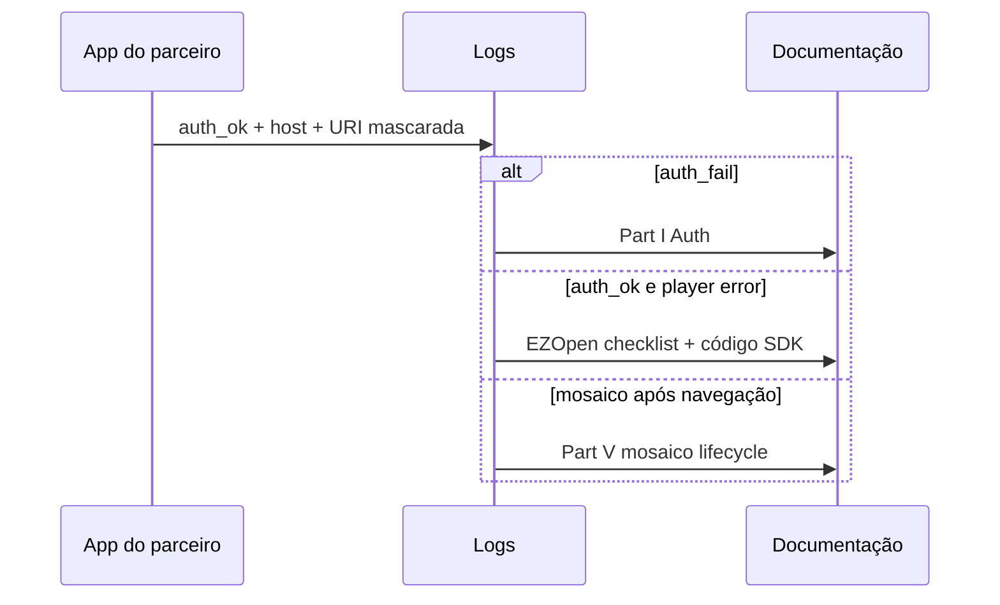

# Integração geral

Ao concluir este capítulo, você será capaz de:

- Instrumentar logs úteis para suporte sem expor segredos.
- Interpretar falhas de auth, URI EZOpen e player usando a documentação compartilhada.
- Executar um checklist de testes antes de go-live em cada plataforma.

## Logging para suporte

Logs devem permitir reconstruir **a sequência de eventos** (auth → URI → mount → play → erro) sem vazar credenciais.

### O que registrar (faça)

| Campo / evento | Exemplo seguro | Por quê |
|----------------|----------------|---------|
| `correlationId` por sessão de usuário | UUID gerado no app | Liga auth, lista de devices e players |
| Resultado de auth | `auth_ok`, `auth_fail`, código HTTP | Separa problema de token de problema de stream |
| Host EZOpen usado | `open.ezviz.com` (fixo) | Confirma que o integrador não substituiu o host na URI — ver [Referência EZOpen](../part-01-shared-concepts/00-ezopen-protocol.md) |
| URI **mascarada** | `ezopen://***/C12****78/1.live` | Confirma formato sem expor serial completo em log agregado |
| Estado do player | `starting`, `playing`, `error`, `disposed` | Essencial para incidentes de mosaico |
| Código de erro do SDK | valor numérico ou enum documentado | Permite busca na documentação oficial |
| Plataforma e versão do SDK | `android-sdk-5.x` | Reprodução |

### O que nunca registrar (não faça)

| Dado | Motivo |
|------|--------|
| `accessToken` completo | Credencial de sessão |
| AppSecret | Segredo de backend |
| URL de auth com query sensível | Pode conter tokens transitórios |
| Senha Wi-Fi de provisioning | Dado de usuário |

> Padronize um prefixo de tag (ex.: `EZVIZ_INT`) para filtrar logs em ferramentas de suporte.

## Interpretação de erros (onde buscar)

Use esta tabela como **índice** — detalhes de API ficam nos capítulos de plataforma (Parts II–IV) e no corpus oficial em `packages/crawler/docs/sdk`.

| Sintoma | Verifique primeiro | Capítulo / artefato |
|---------|-------------------|---------------------|
| Lista de dispositivos vazia com erro | Token, domínio auth, AppKey | [Auth compartilhado](../part-01-shared-concepts/01-auth.md) |
| Player falha imediatamente com URI “correta” | Expiração de token; domínio/auth do SDK desalinhados (Web: `domain` separado do `url`) | [EZOpen](../part-01-shared-concepts/00-ezopen-protocol.md), [Auth](../part-01-shared-concepts/01-auth.md) |
| `.rec` sem vídeo no Web | Escopo cloud-only; janela `begin`/`end` | [Matriz de capacidades](../part-01-shared-concepts/02-glossary-capability-matrix.md) |
| Mosaico lento ou app morto após sair da tela | Teardown de players | [Desempenho e mosaico](01-mosaic-performance.md) |
| Web: tela preta, sem erro claro | Container DOM ausente ou com tamanho zero | [Live Web](../part-04-web/02-live-preview.md) / [Playback Web](../part-04-web/03-playback.md) |
| Uma célula falha, outras ok | Serial/canal offline; não generalizar para token global | Logs por `correlationId` e por célula |

### Fluxo de triagem recomendado

## Ambientes e configuração

| Ambiente | Objetivo |
|----------|----------|
| **Desenvolvimento** | AppKey de teste; poucos dispositivos; logs verbosos |
| **Homologação** | Paridade com produção (HTTPS, domínios híbridos reais); testes de mosaico |
| **Produção** | Logs redigidos; feature flags para grade máxima |

Confirme com o contrato EZVIZ o par **auth/domínio** do SDK (híbrido ou público). As URIs EZOpen usam host fixo `open.ezviz.com`; no Web, domínio customizado vai em propriedade separada (`domain`), não no `url` EZOpen.

## Checklist de testes antes do go-live

Execute **por plataforma** que o parceiro entrega. Marque N/A apenas com justificativa documentada.

### Autenticação e EZOpen

- [ ] Login/token: sucesso, falha e renovação com token expirado simulado.
- [ ] Lista de dispositivos retorna serial esperado antes de abrir player.
- [ ] URI `.live` válida inicia preview em **um** canal.
- [ ] URI `.rec` com `begin`/`end` válidos inicia playback (onde a plataforma suporta).
- [ ] URIs EZOpen com host `open.ezviz.com`; domínio híbrido (se houver) só na config do SDK/Web.

### Player único

- [ ] Erro de rede: app permanece estável; mensagem compreensível.
- [ ] Troca `.live` ↔ `.rec` destrói player anterior (sem vazamento).
- [ ] Rotação de tela / resize (mobile) ou redimensionamento (Web) sem crash.

### Mosaico (se aplicável)

- [ ] Grade no teto de células definido; memória estável após 10 minutos.
- [ ] Sair e reentrar na tela 20 vezes sem crescimento monotônico de RAM.
- [ ] “Parar tudo” / “Iniciar tudo” sem deadlock.
- [ ] Fullscreen e retorno à grade com vídeo correto por célula.
- [ ] Web: N containers, N players; tile removido libera instância.

### Segurança e compliance

- [ ] Nenhum segredo em logs de build de release.
- [ ] Exemplos do app usam placeholders (`YOUR_ACCESS_TOKEN`).
- [ ] Revisão conforme [Segurança](03-security.md).

### Suporte e entrega

- [ ] Versão do SDK e do app no relatório de bug.
- [ ] `correlationId` reproduzível em um fluxo de falha gravado.
- [ ] Stakeholder recebeu PDF + indicação de ler Part I e Part V para mosaico.

## Faça / não faça (resumo)

| Faça | Não faça |
|------|----------|
| Logar estados e códigos de erro | Logar tokens completos |
| Reproduzir com um dispositivo antes do mosaico | Abrir mosaico como primeiro teste |
| Documentar domínios reais do contrato no runbook interno | Copiar URLs Emive dos callouts como se fossem obrigatórias |
| Escalar incidente com URI mascarada + código SDK | Enviar screenshot com QR de provisioning sem borrar |

## Referências cruzadas

- [Desempenho e mosaico](01-mosaic-performance.md)
- [Segurança](03-security.md)
- [Glossário e matriz](../part-01-shared-concepts/02-glossary-capability-matrix.md)

## Checklist de verificação (fechamento)

- [ ] Logs de release não contêm `accessToken` nem AppSecret.
- [ ] Runbook de suporte aponta para Part I e este capítulo.
- [ ] Checklist go-live executado na plataforma alvo com evidência (planilha ou ticket).
- [ ] Time sabe qual código de erro abrir na documentação oficial EZVIZ.
